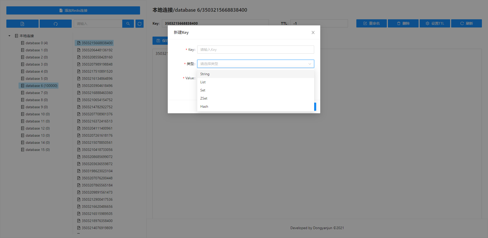

[English](./README.md) | 简体中文

<h1 align="center">Ant Design Pro</h1>

<div align="center">

一款Web版本的Redis管理工具

[](http://umijs.org/) [](https://dev.azure.com/ant-design/ant-design-pro/_build/latest?definitionId=1?branchName=master) [](https://david-dm.org/ant-design/ant-design-pro) [](https://david-dm.org/ant-design/ant-design-pro?type=dev) [![Join the chat at https://gitter.im/ant-design/ant-design-pro](https://img.shields.io/gitter/room/ant-design/ant-design-pro.svg?style=flat-square&logoWidth=20&logo=data%3Aimage%2Fsvg%2Bxml%3Bbase64%2CPD94bWwgdmVyc2lvbj0iMS4wIiBlbmNvZGluZz0iVVRGLTgiPz4NCjxzdmcgeG1sbnM9Imh0dHA6Ly93d3cudzMub3JnLzIwMDAvc3ZnIiB4bWxuczp4bGluaz0iaHR0cDovL3d3dy53My5vcmcvMTk5OS94bGluayIgd2lkdGg9IjkwMCIgaGVpZ2h0PSI2MDAiIHZpZXdCb3g9IjAgMCAzMCAyMCI%2BDQo8ZGVmcz4NCjxwYXRoIGlkPSJzIiBkPSJNMCwtMSAwLjU4Nzc4NSwwLjgwOTAxNyAtMC45NTEwNTcsLTAuMzA5MDE3SDAuOTUxMDU3TC0wLjU4Nzc4NSwwLjgwOTAxN3oiIGZpbGw9IiNmZmRlMDAiLz4NCjwvZGVmcz4NCjxyZWN0IHdpZHRoPSIzMCIgaGVpZ2h0PSIyMCIgZmlsbD0iI2RlMjkxMCIvPg0KPHVzZSB4bGluazpocmVmPSIjcyIgdHJhbnNmb3JtPSJ0cmFuc2xhdGUoNSw1KSBzY2FsZSgzKSIvPg0KPHVzZSB4bGluazpocmVmPSIjcyIgdHJhbnNmb3JtPSJ0cmFuc2xhdGUoMTAsMikgcm90YXRlKDIzLjAzNjI0MykiLz4NCjx1c2UgeGxpbms6aHJlZj0iI3MiIHRyYW5zZm9ybT0idHJhbnNsYXRlKDEyLDQpIHJvdGF0ZSg0NS44Njk4OTgpIi8%2BDQo8dXNlIHhsaW5rOmhyZWY9IiNzIiB0cmFuc2Zvcm09InRyYW5zbGF0ZSgxMiw3KSByb3RhdGUoNjkuOTQ1Mzk2KSIvPg0KPHVzZSB4bGluazpocmVmPSIjcyIgdHJhbnNmb3JtPSJ0cmFuc2xhdGUoMTAsOSkgcm90YXRlKDIwLjY1OTgwOCkiLz4NCjwvc3ZnPg%3D%3D)](https://gitter.im/ant-design/ant-design-pro?utm_source=badge&utm_medium=badge&utm_campaign=pr-badge)  





</div>

- Preview: http://codeoffice.tech

## Usage

### Back-End

```bash
$ cd rdm-web/
$ mvn clean install -U
$ cd rdm-web/target 
$ java -jar rdm-web-0.0.1-SNAPSHOT.jar
```

### FRONT-End

```bash
$ cd rdm-web/web
$ npm install
$ npm start         # visit http://localhost:8000
```

## Browsers support

Modern browsers and IE11.

| [](http://godban.github.io/browsers-support-badges/)</br>IE / Edge | [](http://godban.github.io/browsers-support-badges/)</br>Firefox | [](http://godban.github.io/browsers-support-badges/)</br>Chrome | [](http://godban.github.io/browsers-support-badges/)</br>Safari | [](http://godban.github.io/browsers-support-badges/)</br>Opera |
| --- | --- | --- | --- | --- |
| IE11, Edge | last 2 versions | last 2 versions | last 2 versions | last 2 versions |
